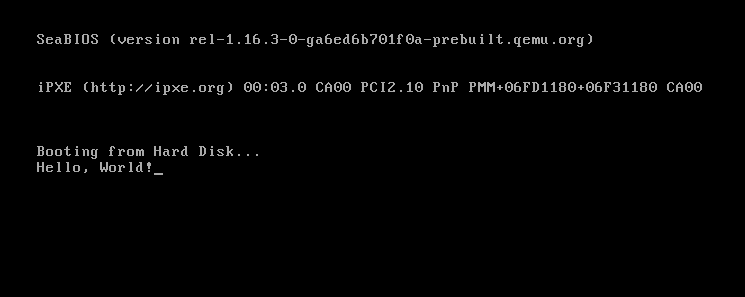

# Booting Our Binary

_"There is no elevator to success — you have to take the stairs." — Zig Ziglar_ 

---

In the previous section, we created a stand alone binary, which is not linked to any standard library. But if you looked closely, and inspected the binary, you would see that although we defined our output format to be 'binary' in the linker script, we got a different format. Why is that?

## Understanding Rust Targets

The compiler of rust, `rustc` is a cross-compiler, which means it can compile the same source code into multiple architectures and operating systems.
This provides us with a lot of flexibility, but it is the core reason for our problem. This is because you are probably compiling this code from a computer with a regular operating system (Linux, Windows or MacOS) which rustc supports, which means that is it's `default target`. To see your default target, you can run `rustc -vV` and look at the `host` section.

The target contains information for the `rustc` compiler about which header should the binary have, what is the pointer and int size, what instruction set to use, and more information about the features of the cpu that it could utilize.
So, because we compiled our code just with `cargo build`, cargo, which under the hood uses `rustc`, compiled our code to our default target, which resulted in a binary that is operating specific and not a truly stand alone even though we used `#![no_std]`.

> **Note:** if you want to see the information of your computer target, use the following command
> ```
> rustc +nightly -Z unstable-options --print target-spec-json
> ```

## Custom Rust Target

To boot our binary, we need to create a custom target that will specify that no vendor or operating system in our [_target triple_](https://clang.llvm.org/docs/CrossCompilation.html#target-triple) is used, and that it will contain the right [architecture](https://simple.wikipedia.org/wiki/Computer_architecture). But, what architecture we need?

In this guide, the operating system that we build will be compatible with the x86_64 computer architecture (and maybe other architectures in the far far future). So, for that we will need to understand what an x86_64 chip expects at boot time.

## BIOS Boot Process

When our computer (or virtual machine) powers on, the first software that the CPU encounters is the [BIOS](https://en.wikipedia.org/wiki/BIOS), which is a piece of software that is responsible to perform hardware initialization during the computer start up. It comes pre installed on the motherboard and as an OS developer, we can't interfere or modify the BIOS in any way.

The last thing BIOS does before handing to us the control over the computer, is to load one sector (512 bytes) form the boot device (can be hard-disk, cd-rom, floppy-disk etc) to memory address `0x7c00` if the sector is considered `valid`, which means that it has the `BIOS Boot Signature` at the end of it, which is the byte sequence `0x55` followed by `0xAA` in offset bytes 510 and 511 respectively.

At this time for backward compatibility reasons, the computer starts at a reduced instruction set, at a 16bit mode called [_real mode_](https://en.wikipedia.org/wiki/Real_mode) which provides direct access to the BIOS interface, and access to all I/O or peripheral device. This mode lacks support for memory protection, multitasking, or code privileges, and has only 1Mib of address space. Because of these limitation we want to escape it as soon as possible, but that is a problem that we will solve later (Maybe add link to when this is done).

## Building Our Target

With this information, we understand that we will need to build a target that will support 16bit real mode.
Unfortunately, if we look at all of the available targets, we would see that there is no target that support this unique need, but, luckily, Rust allows us to create custom targets!

As a clue, we can try and peak on the builtin targets, and check if there is something similar that we can borrow. For example, my target, which is the x86_64-unknown-linux-gnu looks like this:
```json,icon=@https://www.svgrepo.com/show/373712/json.svg
{
  "arch": "x86_64",
  "cpu": "x86-64",
  "crt-static-respected": true,
  "data-layout": "e-m:e-p270:32:32-p271:32:32-p272:64:64-i64:64-i128:128-f80:128-n8:16:32:64-S128",
  "dynamic-linking": true,
  "env": "gnu",
  "has-rpath": true,
  "has-thread-local": true,
  "link-self-contained": {
    "components": [
      "linker"
    ]
  },
  "linker-flavor": "gnu-lld-cc",
  "llvm-target": "x86_64-unknown-linux-gnu",
  "max-atomic-width": 64,
  "metadata": {
    "description": "64-bit Linux (kernel 3.2+, glibc 2.17+)",
    "host_tools": true,
    "std": true,
    "tier": 1
  },
  "os": "linux",
  "plt-by-default": false,
  "position-independent-executables": true,
  "pre-link-args": {
    "gnu-cc": [
      "-m64"
    ],
    "gnu-lld-cc": [
      "-m64"
    ]
  },
  "relro-level": "full",
  "stack-probes": {
    "kind": "inline"
  },
  "static-position-independent-executables": true,
  "supported-sanitizers": [
    "address",
    "leak",
    "memory",
    "thread",
    "cfi",
    "kcfi",
    "safestack",
    "dataflow"
  ],
  "supported-split-debuginfo": [
    "packed",
    "unpacked",
    "off"
  ],
  "supports-xray": true,
  "target-family": [
    "unix"
  ],
  "target-pointer-width": "64"
}
```
This target has some useful info that we can use, like useful keys, such as `arch`, `linker-flavor`, `cpu` and more, that we will use in our target, and even the `data-layout` that we will copy almost entirely. Our final, 16bit target, will look like this:

```json,fp=<repo>build/targets/16bit_target.json,icon=@https://www.svgrepo.com/show/373712/json.svg
{
// The general architecture to compile to, x86 cpu architecture in our case
"arch": "x86",

// Specific cpu target - Intel i386 CPU Which is the original 32-bit cpu
// Which is compatible for 16-bit real mode instructions
"cpu": "i386",

// Describes how data is laid out in memory for the LLVM backend, split by '-':
// e          -> Little endianness (E for big endianness)
// m:e        -> ELF style name mangling
// p:32:32    -> The default pointer is 32-bit with 32-bit address space
// p270:32:32 -> Special pointer type ID-270 with 32-bit size and alignment
// p271:32:32 -> Special pointer type ID-271 with 32-bit size and alignment
// p271:64:64 -> Special pointer type ID-272 with 64-bit size and alignment
// i128:128   -> 128-bit integers are 128-bit aligned
// f64:32:64  -> 64-bit floats are 32-bit aligned, and can also be 64-bit aligned
// n:8:16:32  -> Native integers are 8-bit, 16-bit, 32-bit
// S128       -> Stack is 128-bit aligned
"data-layout": "e-m:e-p:32:32-p270:32:32-p271:32:32-p272:64:64-i128:128-f64:32:64-f80:32-n8:16:32-S128",

// No dynamic linking is supported, because there is no OS runtime loader.
"dynamic-linking": false,

// This target is allowed to produce executable binaries.
"executables": true,

// Use LLD's GNU compatible frontend (`ld.lld`) for linking.
"linker-flavor": "ld.lld",

// Use the Rust provided LLD linker binary (bundled with rustup)
// This makes that our binary can compiled on every machine that has rust.
"linker": "rust-lld",

// LLVM target triple, code16 indicates for 16bit code generation
"llvm-target": "i386-unknown-none-code16",

// The widest atomic operation is 64-bit (TODO! Check if this can be removed)
"max-atomic-width": 64,

// Disable position independent executables
// The position of this executable matters because it is loaded at address 0x7c00
"position-independent-executables": false,

// Disable the redzone optimization, which saves in advance memory
// on a functions stack without moving the stack pointer which saves some instructions
// because the prologue and epilogue of the function are removed
// this is a convention, which means that the guest OS
// won't overwrite this otherwise 'volatile' memory
"disable-redzone": true,

// The default int is 32-bit
"target-c-int-width": "32",

// The default pointer is 32-bit
"target-pointer-width": "32",

// The endianness, little or big
"target-endian": "little",

// panic strategy, also set on cargo.toml
// this aborts execution instead of unwinding
"panic-strategy": "abort",

// There is no target OS
"os": "none",

// There is not target vendor
"vendor": "unknown",

// Use static relocation (no dynamic symbol tables or relocation at runtime)
// Also means that the code is statically linked.
"relocation-model": "static"
}
```
Now, the only thing left to do before we can run our code, is to include the boot signature at our binary. This can be done in the linker script by adding the following lines: 

```linker,fp=linker_script.ld
SECTIONS {

    /* 
      Make the start offset of the file 0x7c00 This is useful, 
      because if make jump to a function that it's offset in the binary is 0x100, 
      it will actually be loaded at address 0x7d00 by the BIOS, and not 0x100, 
      so we need to consider this offset, and that's how we do it. 
    */
    . = 0x7c00;

    /* 
      Currently, we have nothing on the binary,
      if we write the signature now, it will be at the start of the binary. 
      Because we want the signature to start at the offset of 510 in our binary, 
      we pad it with zeros.
    */
    .fill : {
        FILL(0)
        . = 0x7c00 + 510;
    }


    /* Write the boot signature to make the sector bootable */
    .magic_number : { SHORT(0xaa55) }
}
```

To compile our code, we just need to run the following command:
```
cargo +nightly build --release --target .\16bit_target.json -Z build-std=core
```

The `+nightly` tells rust to use the nightly toolchain, which includes a lot of feature that we will use, including the -Z flag to rustc.
 
The `build-std` flag tells cargo to also compile the core library with the specified target, and not use the precompiled default in our system.

To see that indeed, the boot signature is in the correct place, we can use the `Format-Hex` command in windows or the `hexdump` command in Linux or MacOS to see the hex of our file.

This should result in a lot of zeros, and at the end, this line, where we can see the boot signature in the right offset
`000001F0   00 00 00 00 00 00 00 00 00 00 00 00 00 00 55 AA` 


> **Note:**
> If you are like me, and you don't like to specify a lot of configuration in the command of compiling, these arguments can be specified in the following configuration files.
> 
> ```toml,fp=rust-toolchain.toml
> [toolchain]
> channel = "nightly"
> ```
> To define that the default toolchain is the nightly toolchain
> 
> ```toml,fp=.cargo/config.toml
> [unstable]
> build-std = ["core"]
> ```
> To add the unstable `build-std` flag with the core parameter in it.

## Running Our Code

Because our code is experimental, we will not want to run it on our machine, because it can make **PERMANENT DAMAGE** to it. This is because we don't monitor cpu temperature, and other hardware sensors that can help us protect our pc. Instead, we will run our code in [QEMU](https://www.qemu.org/), which is a free and open-source full machine emulator and virtualizer. To download QEMU for your platform, follow the instructions [here](https://www.qemu.org/download/)

To make a sanity check that QEMU indeed works on your machine with our wanted architecture after you downloaded it, run `qemu-system-x86_64` on a terminal. This should open a window and in it write some messages it tries to boot from certain devices, and after it fails, it should write it cannot find any bootable device. If that's what you are seeing, it all works as it should!  

To provide our code, we need to add the `-drive format=raw,file=<path-to-bin-file>` flag to qemu, which will add to our virtual machine a disk drive with our code.

If you are following the [walkthrough](https://github.com/learnix-os/LearnixOS-Book-Walkthrough), this is the command you need to run.

```
qemu-system-x86_64 -drive format=raw,file=target/16bit_target/release/LearnixOS-Book-Walkthrough
```

At a first glance, we might think our code still doesn't work, because all we see is a black screen, but, if you notice closely, we don't get more messages of the BIOS trying other boot devices, and we don't get the message of `"No bootable device."`. 

So why we see black screen? This is because we didn't provide the computer any code to run and our main function is empty, but now we have the platform to write any code that we like!

## Hello, World!
To print "Hello, World!", we can utilize the BIOS [video interrupt](https://en.wikipedia.org/wiki/INT_10H) which can help us print [ASCII](https://en.wikipedia.org/wiki/ASCII) characters to the screen.

_For now, don't worry about the code implementation and just use and play with it. This code piece, and a lot more will be explained in the next chapter._

```rust,fp=main.rs
use core::arch::asm;

#[unsafe(no_mangle)]
fn main() {
    let msg = b"Hello, World!";
    for &ch in msg {
        unsafe {
            asm!(
                "mov ah, 0x0E",   // INT 10h function to print a char
                "mov al, {0}",    // The input ASCII char
                "int 0x10",       // Call the BIOS Interrupt Function
                // --- settings ---
                in(reg_byte) ch,  // {0} Will become the register with the char
                out("ax") _,      // Lock the 'ax' as output reg, so it won't be used elsewhere
            );
        }
    }

    unsafe {
        asm!("hlt"); // Halt the system
    }
}
```

When we try to compile and run our code, we can see that it's indeed booting, but we don't see any massage.
If you believe me that the code above is correct, and indeed works, we can try and look at the binary file that the compiler emitted with the `hexdump` command in Linux or MacOS, or `Format-Hex` in Windows.

When we do that, we can notice that it seems that more code was added, but at the end of the file, and not at the start of it, and more over, it is located after the first sector which means it doesn't even loaded by the BIOS. To resolve this, we need to learn about the default segment `rustc` generates.

> ### Default Segments In Rust 
> - **.text** - Includes the code of our program, which is the machine code that is generated for all of the functions
>   ```rust,banner=no
>   fn some_function(x: u32, y: u32) -> u32 {
>     return x + y;
>   }
>   ```
> - **.data** - Includes the initialized data of our program, like static variables.
>   ```rust,banner=no
>   static VAR: u32 = 42;
>   ```
> - **.bss** - Includes the uninitialized data of our program
>   ```rust,banner=no
>   static mut MESSAGE: String = MaybeUninit::uninit();
>   ```
> - **.rodata** - Includes the read-only data of our program
>   ```rust,banner=no
>   static mut MESSAGE: &'static str = "Hello World!";
>   ```
> - **.eh_frame & .eh_frame_hdr** - Includes information that is relevant to exception handling and stack unwinding. These section are not relevant for us because we use `panic = "abort"`.

So, to make our linker put the segments in the right position, we need to change the `SECTION` segment of our linker script to this. 

```linker,fp=linker_script.ld
SECTIONS {

    . = 0x7c00;

    /* 
      Rust also mangles segment names. 
      The "<segment_name>.*" syntax is used to also include all the mangles   
    */

    .text : { *(.text .text.*) }
    .bss : { *(.bss .bss.*) }
    .rodata : { *(.rodata .rodata.*) }
    .data : { *(.data .data.*) }
    /DISCARD/ : {
        *(.eh_frame .eh_frame.*)
        *(.eh_frame_hdr .eh_frame_hdr.*) 
    }

    . = 0x7c00 + 510;

    .magic_number : { SHORT(0xaa55) }
}
```

Now, when we compile and run our code, we can see our message!

<figure><figcaption></figcaption></figure>
