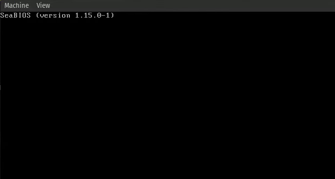

# Debugging Our Operating System

_"If debugging is the process of removing bugs, then programming must be the process of putting them in." — Edsger W. Dijkstra_

---

Debugging is a crucial part for a good operating system, and especially on the start of the development when we still don't have good debugging methods, like printing, we need to use other methods.

By far the most annoying bug is the triple fault, which will be explained extensively in the [Interrupts](ch05-00-interrupts-and-exceptions.md) Chapter. In short, this is an error that is not recoverable, and the CPU will reset itself, and it looks like this:

<figure><figcaption></figcaption></figure>

Although this state is not recoverable, there are some methods to debug it even without having the ability to print.

## Reverse Engineering our Code

One of the most useful methods to debug our code is to use a disassembler. A disassembler is a tool that takes binary code and converts it back into assembly language, which can help us understand what the CPU is executing at any given time.

By analyzing the assembly code, we can gain insights into the control flow and data manipulation happening within our operating system. This can be especially helpful when trying to identify the root cause of a bug or unexpected behavior.

## Extracting Memory Dumps

Another useful debugging technique is to extract memory dumps. A memory dump is a snapshot of the contents of the system's memory at a specific point in time. By examining the memory dump, we can see the state of various variables, data structures, and the stack at the moment of failure.

This provides valuable information about CPU structures that we are loading to the CPU, which might cause the triple fault if we don't initialize them correctly.

A memory dump can be obtained with the following commands.

First, run the qemu virtual machine with the `--monitor stdio` option to enable the QEMU monitor interface in the terminal.

Then, in this terminal, run the following command:

```
(qemu) pmemsave <start_address> <size> <file name>

// For example

(qemu) pmemsave 0x1000 0x500 memory.dump

// This wil create a dump of size 0x500 from 0x1000 - 0x1500.
```


## Minimal Printing

Once we write our kernel, the first thing that we will do is to write a print method with formatting, because it is one of the best ways to debug our code.

In the bootloader, in a time we didn't write our print yet, we will mostly debug with the methods above, but we can for debug purposes print characters, and even small strings using the BIOS like we did in our [Hello, World!](./ch01-02-booting-our-binary.md) program.